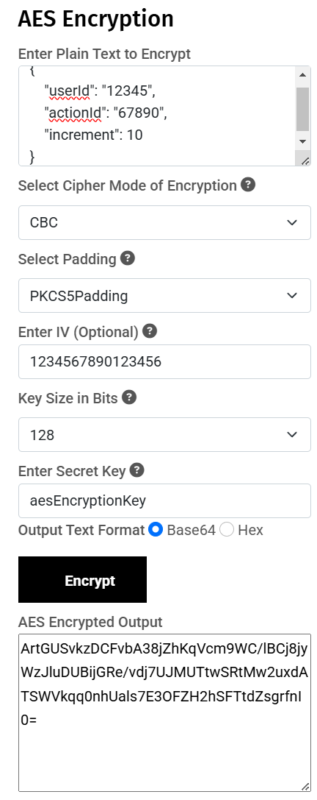
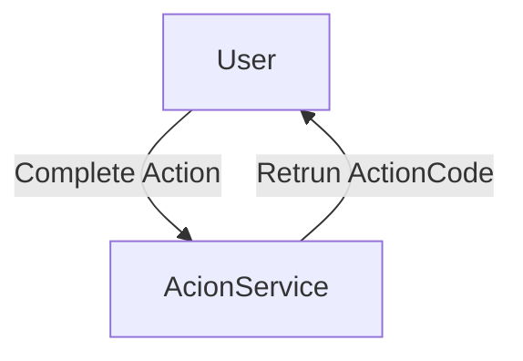
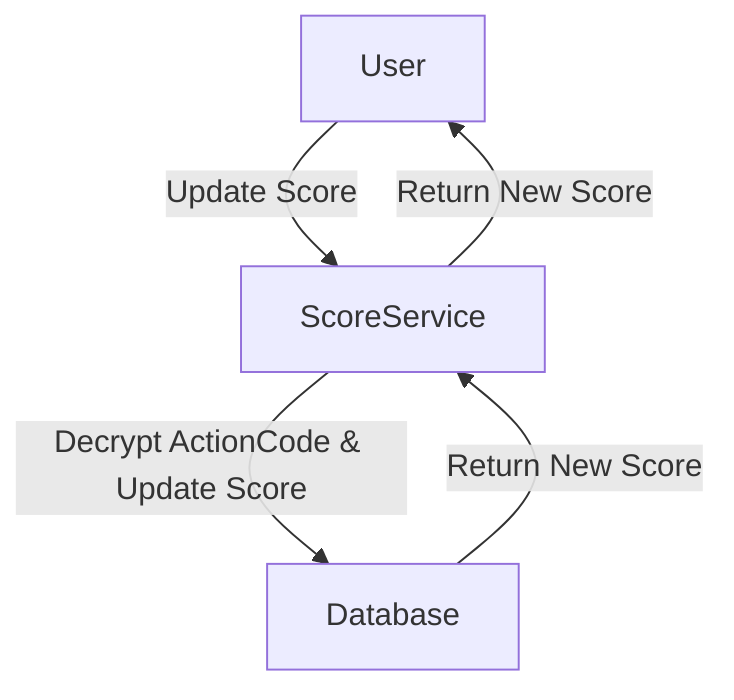
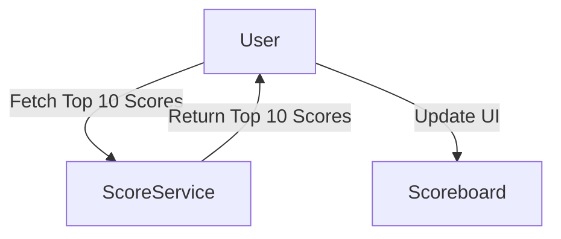

# Scoreboard API Module Specification

## Overview
This module handles user score updates and maintains a real-time scoreboard, which show the top 10 users' score.

## Features
- Live Scoreboard Updates: The top 10 scores are updated and displayed in real-time.
- Score Increment API: Users' scores increase upon completing specific actions.
- Security Measures: Prevent malicious users from increasing scores without authorisation.

## Flow Diagram
When a user completes an action, ActionService return an ActionCode to the user. ActionCode is the encrypted data that contains the user ID, action Id and the score increment. Here is an example of ActionCode:

    

The user then sends the ActionCode to the ScoreService to update the score. The ScoreService decrypts the ActionCode, updates the score in the database, and returns the new score to the user.

 The user can fetch the top 10 scores from the ScoreService, which updates the scoreboard UI.

## API Endpoints

### 1. Update User Score

- Endpoint: POST /api/score/update
- Description: Increases a user’s score when an action is completed.
- Request Headers:
        Authorization: Bearer <JWT_TOKEN> (for authentication)
- Request Body (JSON):

        {
            "userId": "12345",
            "actionCode": "ArtGUSvkzDCFvbA38jZhKiBK122J3sxeg2JxvvSesJ6VLx6Ut5E5hC/5JHC1pI1UT0DW4egZQ+mUuAvFYG5gIAB0DHemkNHIQ5fqGvk+Lxk="
        }
- Response (Success, HTTP 200):

        {
            "message": "Score updated successfully",
            "increment": 10,
            "newScore": 150
        }
- Response (Unauthorized, HTTP 401):

        {
            "error": "Invalid actionCode or missing authentication token"
        }

### 2. Get Top 10 Scores

- Endpoint: GET /api/score/top
- Description: Fetches the top 10 highest scores.
- Request Headers: None
- Request Body: None
- Response (Success, HTTP 200):

        {
            "topScores": [
                {"userId": "12345", "score": 200},
                {"userId": "67890", "score": 190},
                ...
            ]
        }

### Security Considerations
- Authentication: Every request must include a valid JWT token.
- Rate Limiting: Prevent score inflation via repeated requests.
- Server-Side Validation: Ensure valid user IDs and score increments (check after decrypting ActionCode successfull).

### Technologies
- Backend Framework: NestJS
- Database: PostgreSQL/ Redis (for caching leaderboard)
- Authentication: JWT-based authentication
- WebSocket: For real-time scoreboard updates
- Decryption: AES encryption (key size: 256bit, mode: CBC) for ActionCode
WebSocket / SSE: For real-time scoreboard updates
